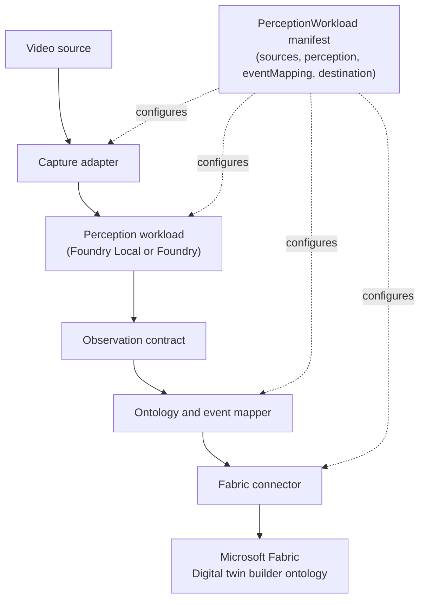
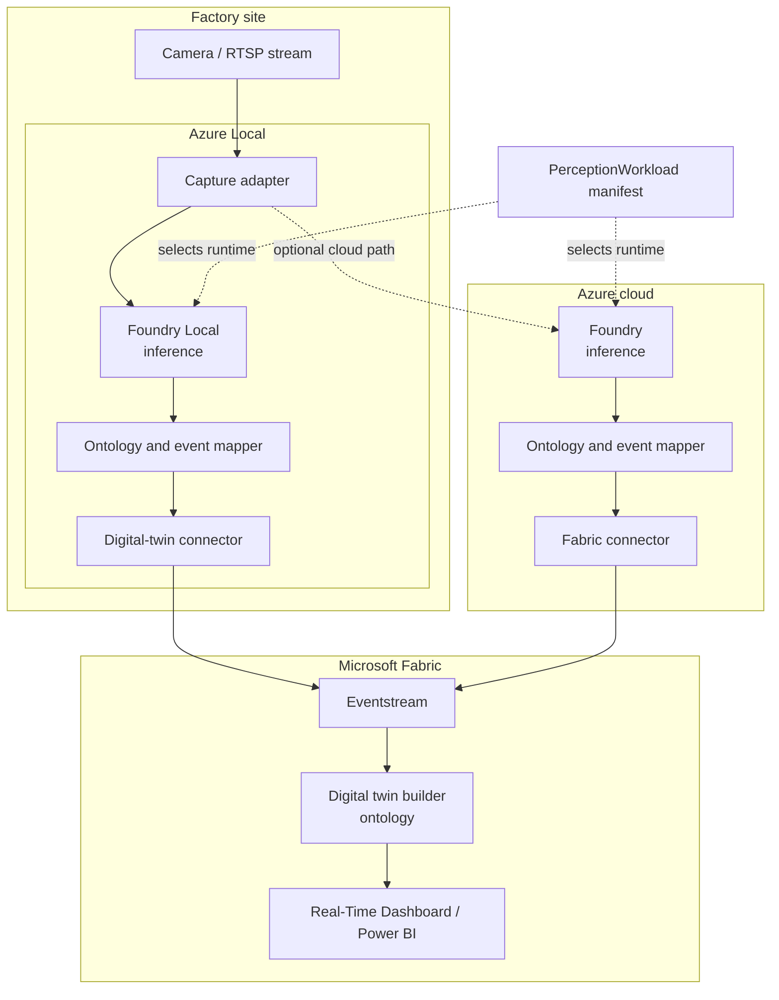

## Summary

Build a small Azure-aligned accelerator that lets a demo or evaluation team assemble one factory video workload from reusable perception components and publish its results into a Microsoft Fabric digital twin, built with Digital twin builder (preview) in Fabric Real-Time Intelligence.

Fabric is a core part of this solution, not a swappable option: the ontology, entity and relationship model, and downstream visualization all live in Fabric. The connector's job is to keep the ingestion path (Eventstream) as the only Fabric-specific integration point.

The MVP focuses on one line or process-monitoring scenario. The same workload should be runnable with local inference on Foundry Local on Azure Local and with cloud inference through Foundry, with the integration contract staying stable.

This is a technical hypothesis, not yet a user-validated product requirement. The MVP should therefore optimize for learning and demonstrability over production completeness.

## User And Problem

The primary user is a demo or evaluation team preparing repeatable factory scenarios. Today, changing a model, camera input, or process rule can require rewriting the surrounding integration. That makes demonstrations slow to prepare and makes it difficult to compare edge and cloud execution.

The MVP tests whether a stable event contract and a small set of composable adapters reduce that friction.

## Hypothesis

If perception workloads expose a common, ontology-aware event contract, then a team can swap or recombine the camera adapter, inference provider, and process rule without changing the digital-twin integration.

The hypothesis is supported when the team can create a second variation of the initial scenario by changing one or more perception components while keeping the Fabric connector and ontology unchanged.

## MVP Scope

### In scope

* One camera or prerecorded video source
* One line or process-monitoring scenario
* A replaceable perception step that produces observations
* A small ontology for the selected scenario, such as `Line`, `Station`, `Product`, `ProcessState`, and `Observation`
* A rule or mapping step that turns observations into process events
* Two inference modes: Foundry Local on Azure Local and Foundry in the cloud
* One connector that publishes process events into a Microsoft Fabric Eventstream feeding a Digital twin builder ontology
* A simple configuration file for selecting the source, inference mode, ontology mappings, and destination
* Basic logs and a repeatable demo path

### Out of scope

* Production-grade fleet management
* Multi-camera synchronization
* Model training or model lifecycle management
* A digital-twin platform other than Microsoft Fabric
* A complete ontology for manufacturing
* High availability, autoscaling, or security certification
* Broad support for every factory use case
* A polished end-user application

## Proposed Design

```text
Video source
    |
    v
Capture adapter
    |
    v
Perception workload
(Foundry Local or Foundry)
    |
    v
Observation contract
    |
    v
Ontology and event mapper
    |
    v
Fabric connector
    |
    v
Microsoft Fabric (Digital twin builder ontology)
```



Each block should have a narrow interface. The MVP can implement the interfaces in one repository and one deployable process; separate services are not required.

### Capture adapter

Reads a camera stream or prerecorded clip and emits timestamped frames. The adapter hides the input details from the perception workload.

### Perception workload

Consumes frames and emits observations. An observation should include at least:

* `subjectId`
* `observationType`
* `value`
* `timestamp`
* `confidence`
* `source`

The workload may use a simple existing model or mocked inference for the first demonstration. The interface matters more than model sophistication.

### Ontology and event mapper

Maps observations to a small, scenario-specific vocabulary and emits process events. Keep the ontology narrow enough to understand and inspect during a demo. Do not attempt to model the whole factory.

Example event:

```json
{
  "eventType": "ProcessStateChanged",
  "subjectId": "station-01",
  "state": "blocked",
  "timestamp": "2026-08-18T12:00:00Z",
  "confidence": 0.91,
  "source": "foundry-local"
}
```

### Fabric connector

Translates the common process event into records on a Microsoft Fabric Eventstream, which feeds entity and relationship instances in a Digital twin builder (preview) ontology. This is the only component that should know Fabric-specific details such as the Eventstream endpoint, entity mapping, and workspace.

For the MVP, the connector targets one Fabric workspace and one Eventstream. A local sink or recorded payload should be available when the real Eventstream is not accessible.

### Configuration

Use one human-readable configuration file to select the runtime and mappings:

```yaml
source: sample-line-video
inference: foundry-local
ontology: line-monitoring-v1
destination: fabric-digital-twin-builder
```

The exact file format can follow the repository's implementation language and tooling. Avoid building a separate configuration service.

## Runtime Modes

The same pipeline and event contract should support two modes:

* Edge mode runs inference through Foundry Local on Azure Local and publishes events from the local environment.
* Cloud mode runs inference through Foundry and publishes events through the same mapper and connector boundary.

The MVP does not need identical model outputs in both modes. It does need comparable event shapes and an explicit indication of which runtime produced each observation.

### Infrastructure



Edge mode keeps capture, inference, mapping, and the connector on Azure Local, near the camera. Cloud mode swaps only the inference stage for Foundry in Azure; the mapper, connector, and Fabric destination stay the same, which is what the manifest's `perception.provider` field controls. Both modes converge on the same Fabric Eventstream, so the ontology and downstream dashboards never need to know which runtime produced an event.

## Demo Flow

1. Start the pipeline against a prerecorded line-monitoring clip.
2. Select edge inference in the configuration.
3. Show observations and mapped process events.
4. Verify that the Fabric ontology receives the event and updates the corresponding entity.
5. Change the inference mode or swap one perception component.
6. Run the same clip again without changing the Fabric connector.
7. Compare the emitted event shape and basic latency or throughput measurements.

## Success Criteria

The MVP is successful when all of the following are true:

* The team can run one line-monitoring scenario from a documented command or script.
* The edge and cloud modes produce the same event contract.
* The Fabric connector is unchanged when the inference mode is changed.
* A second scenario variation can be created by changing configuration or replacing one component, without rewriting the connector.
* A new team member can understand and run the demo from the repository documentation.
* The team records enough timing and output information to compare the two runtime modes.

Suggested initial targets:

* Assemble the first scenario in one working day after the base pipeline exists.
* Create the second variation in less than half a day.
* Keep the demo path under five minutes from startup to a visible Fabric ontology update.

These targets are working assumptions and should be revised after the first user walkthrough.

## Validation Plan

The first validation should be a short internal or partner walkthrough with the people who prepare factory demonstrations.

Ask them to:

* Assemble the initial scenario from the documentation.
* Change the inference mode.
* Replace or adjust one perception component.
* Explain which parts they expect to reuse for another factory scenario.

Measure setup time, changes required, failures encountered, and whether the resulting event is understandable in the Fabric ontology. If the team still needs to edit the connector for common variations, the contract or component boundary is not yet useful.

## Risks And Decisions

* Digital twin builder is in preview and has constraints such as no Autoscale Billing for Spark compatibility and limits on renaming or removing mapped properties. Confirm these constraints against the target Fabric tenant before committing to the demo timeline.
* Foundry Local and Foundry may expose different model capabilities or operational constraints. Treat runtime selection as an adapter boundary and test one representative model path in each mode.
* Ontology work can expand indefinitely. Limit the first vocabulary to the selected process scenario and document what is intentionally missing.
* A prerecorded video can hide real camera and network problems. Use it for repeatability, then perform one live-camera smoke test before calling the MVP complete.
* The concept currently comes from a technical hypothesis rather than direct user research. Do not interpret the success criteria as proof of customer demand.

## Implementation Sequence

1. Define the observation and process-event contracts with sample payloads.
2. Build the prerecorded-video capture adapter and a deterministic sample workload.
3. Add the ontology mapper and a local event sink.
4. Add the Fabric connector, targeting an Eventstream and a Digital twin builder ontology.
5. Add the edge and cloud inference adapters behind the same interface.
6. Document and rehearse the demo flow.
7. Run the validation walkthrough and record what should be changed before expanding scope.

## Open Questions

* Which Fabric workspace, capacity, and tenant settings will host the Digital twin builder item for the MVP?
* Which process state or event is most useful for the first line-monitoring demonstration?
* Is a real model required for the first demo, or is a deterministic workload sufficient to validate composition?
* What evidence would justify expanding from one scenario to multiple dark-factory use cases?
